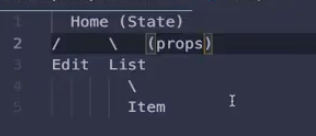

item记得要写key,使用index会影响效能

需要熟悉一下fetch

收获：我感觉最大的收获是学会了“拆分”和对文件结构有了更深刻的理解。比如可以吧url等一些常用的常量放在global里，然后export出去，这样做很方便后面看代码的人进行修改和阅读。

用到的hook：

useState

useEffect

useRef

submittingStatus在删除函数和增加函数内首先都要设置为true（此时不能fetchSet数据）

在修改data之后吧submittingStatus设置为false，此时监测到数据变化就fetchSet数据
